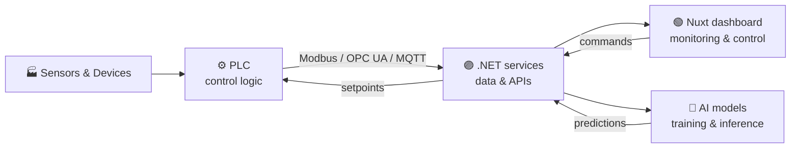

<!-- Header -->
<p align="center">
  
</p>

<p align="center">
  <a href="https://github.com/shaxboz1011">
    
  </a>
</p>

<p align="center">
  
  
  
  <a href="https://github.com/shaxboz1011?tab=followers"></a>
</p>

---

## About me

I'm an engineer who works across the full stack of modern systems: **web platforms**, **industrial automation**
and **artificial intelligence**. I build the interfaces people use, the services behind them, the control logic that
runs machines on the shop floor, and the models that make those machines smarter.

```csharp
public sealed class Shaxboz : Engineer
{
    public string Location  => "Uzbekistan";

    public string[] Web        => ["Nuxt", "Vue", "TypeScript", "Tailwind CSS"];
    public string[] Backend    => ["C#", ".NET", "ASP.NET Core", "REST / WebSockets"];
    public string[] Automation => ["PLC programming", "IEC 61131-3", "Structured Text", "Ladder Logic", "SCADA / HMI"];
    public string[] Protocols  => ["Modbus RTU/TCP", "OPC UA", "MQTT", "Serial / RS-485"];
    public string[] Devices    => ["C / C++", "Microcontrollers", "Arduino", "Raspberry Pi"];
    public string[] AI         => ["Python", "PyTorch", "Model training", "Computer vision", "Edge AI"];

    public string Motto => "From the sensor to the screen.";
}
```

## What I do

<table>
  <tr>
    <td width="33%" valign="top">
      <h3>🌐 Web platforms</h3>
      Production-grade applications with <b>Nuxt</b> on the front end and <b>C# / .NET</b> on the back end —
      SSR, clean APIs, real-time dashboards and polished UI.
    </td>
    <td width="33%" valign="top">
      <h3>⚙️ Industrial automation</h3>
      Writing and commissioning <b>PLC</b> programs, controlling devices and production lines, and connecting
      hardware to software through <b>Modbus</b>, <b>OPC UA</b> and <b>MQTT</b>.
    </td>
    <td width="33%" valign="top">
      <h3>🧠 Artificial intelligence</h3>
      Collecting data, <b>training and fine-tuning models</b>, and deploying them where they matter —
      from cloud services to edge devices next to the machine.
    </td>
  </tr>
</table>

## How it fits together



## Tech stack

**Web & Backend**

<p>
  
</p>

**Devices & Embedded**

<p>
  
</p>

**Industrial Automation**

<p>
  
  
  
  
  
  
</p>

**AI & Data**

<p>
  
</p>

**Tools & DevOps**

<p>
  
</p>

## Currently focused on

- 🔗 Connecting PLC-controlled equipment to modern **.NET** services and **Nuxt** dashboards in real time
- 🧠 Training AI models for **predictive maintenance** and **visual quality inspection**
- ⚡ Running models on the **edge**, close to the machines they monitor
- 🤝 Open to collaboration on **industrial IoT**, **automation** and **AI** projects

## GitHub stats

<p align="center">
  
  
</p>

<p align="center">
  
</p>

## Connect with me

<p>
  <a href="https://www.linkedin.com/in/shaxboz-aliqulov-53b47b21a/"></a>
  <a href="https://t.me/shaxboz1011"></a>
  <a href="mailto:shaxbozpc@gmail.com"></a>
  <a href="https://www.instagram.com/aliqulov__shaxboz/"></a>
</p>

<!-- Footer -->
<p align="center">
  
</p>
